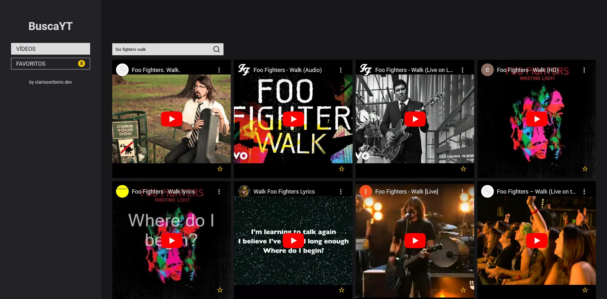
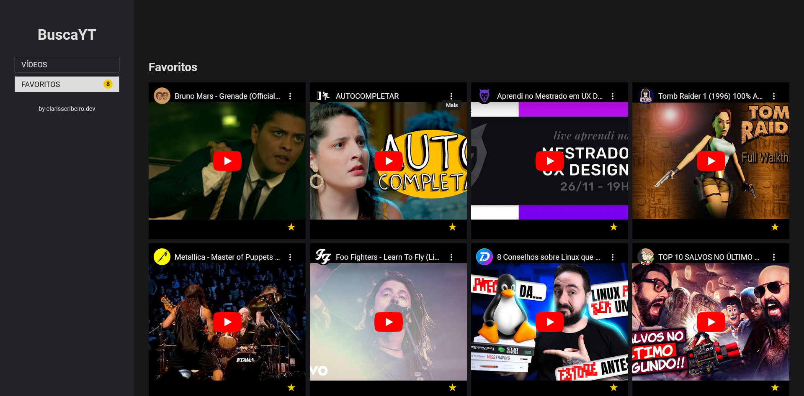
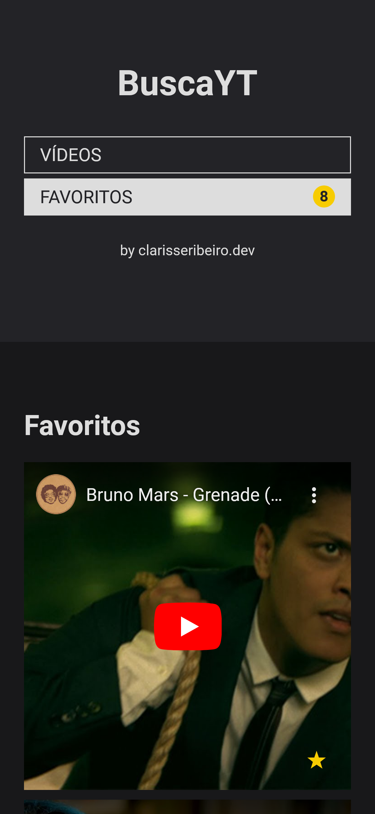

# BuscaYT

Este projeto é uma aplicação web que usa microfrontends para criar uma interface de usuário dividida em duas partes, elas que permite que os usuários busquem, reproduzam e favoritem vídeos no YouTube. Os vídeos favoritados também podem ser visualizados separadamente.

## Componentes da Aplicação

-   mf_drawer:

    -   Navegação entre as seções de vídeos e favoritos.
    -   Contém dois links: "VÍDEOS" e "FAVORITOS".

-   mf_videos:

    -   Busca e listagem de vídeos usando a API do YouTube.
    -   Capacidade de reproduzir vídeos.
    -   Opção de marcar vídeos como favoritos, com um contador mostrando o total de vídeos favoritos.
    -   Listagem de vídeos favoritos ao clicar em "Favoritos".

-   front-end:

    -   Exibe os dois microfrontends.

-   bff:

    -   Back-end das aplicações.

## O que foi utilizado

### Front-end

-   HTML5
-   CSS/SASS
-   JavaScript
-   Microfrontends

### Back-end

-   Node.js
-   Express

### Ferramentas

-   Docker
-   Git
-   Nginx
-   VSCode

### APIs

-   API de busca do Youtube

### Testes

-   Testes unitários com Jest

### Práticas

-   Navegação por rotas
-   Controle de sessão
-   Código tipado
-   Design responsivo
-   BEM

### Automação

-   Gulp
-   Gulp-Sass
-   Gulp-sourcemaps
-   ESLint
-   Prettier

## Executando o projeto

### Rodar a aplicação

1. `npm i` (na pasta raiz, para instalar o package)
2. `cd bff` (navegue até a pasta bff)
3. `npm i` (instale o package da pasta bff)
4. `cd ..` (volte para a pasta principal)
5. Gere sua KEY no link abaixo e insira como valor da variavel API_KEY no arquivo script.js da pasta mf_videos https://developers.google.com/youtube/v3/docs/search/list
6. Inicie o Docker
7. `npm start` (inicia o docker compose)
8. http://localhost:3001/ (acesse o front-end)

### Gulp

1. `gulp` (na pasta raiz, executa o gulp, que compila o SASS)

## Prints

## Tasks

-   [ ] Tipar codigo
-   [ ] Testes unitários (Jest)
